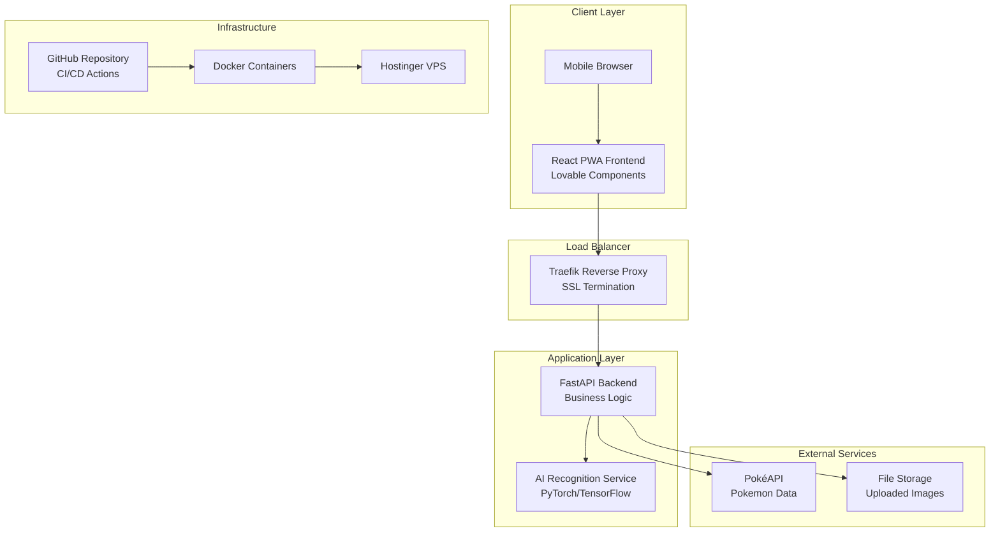

# Design Document

## Overview

The Pokédex Image Recognition Application is a full-stack web application that combines modern frontend technologies with AI-powered image recognition to create an intuitive Pokémon identification system. The architecture follows a microservices approach with clear separation of concerns, implementing a mobile-first Progressive Web App (PWA) frontend built with React and Lovable components, a FastAPI backend for business logic and API orchestration, and a dedicated AI service for image recognition.

The system is designed to handle concurrent users efficiently while maintaining sub-10-second response times for image recognition and sub-3-second page load times. The architecture supports horizontal scaling and implements proper error handling, caching strategies, and monitoring capabilities.

## Architecture

### High-Level Architecture



### Technology Stack Decision Matrix

| Component | Technology | Rationale |
|-----------|------------|-----------|
| Frontend | React + Lovable | Mobile-first design, component reusability, PWA capabilities |
| Backend API | FastAPI | High performance, automatic OpenAPI docs, async support |
| AI Model | Pre-trained CNN (Roboflow) | Faster time-to-market, proven accuracy, lower maintenance |
| Database | PostgreSQL | ACID compliance, JSON support, scalability |
| Caching | Redis | Fast in-memory caching, session management |
| File Storage | Local filesystem + CDN | Cost-effective for MVP, easily upgradeable |
| Containerization | Docker + Docker Compose | Environment consistency, easy deployment |
| Reverse Proxy | Traefik | Automatic SSL, service discovery, load balancing |

### AI Model Architecture Decision

After evaluating options, the design recommends using a **pre-trained Pokémon classification model** from Roboflow Universe or similar platforms for the following reasons:

1. **Time to Market**: Pre-trained models are immediately available
2. **Accuracy**: Community-trained models often have high accuracy (85-95%)
3. **Maintenance**: No need to manage training pipelines or datasets
4. **Scalability**: Can be easily swapped or upgraded

**Fallback Strategy**: If pre-trained models don't meet accuracy requirements, implement a custom fine-tuned model using:
- Base model: MobileNetV3 or EfficientNet (optimized for mobile)
- Dataset: PokéAPI sprites + community datasets (~50,000 images)
- Training: Transfer learning approach

## Components and Interfaces

### Frontend Components

#### Core Components
```typescript
// Component hierarchy
App
├── Router
├── Header
├── CameraCapture
│   ├── CameraInterface
│   ├── FileUpload
│   └── ImagePreview
├── LoadingScreen
├── ResultsDisplay
│   ├── PokemonCard
│   ├── StatsDisplay
│   └── AbilitiesDisplay
└── ErrorBoundary
```

#### Key Interfaces
```typescript
interface PokemonIdentification {
  name: string;
  confidence: number;
  pokemonId: number;
  alternativeMatches?: PokemonMatch[];
}

interface PokemonData {
  id: number;
  name: string;
  types: string[];
  height: number;
  weight: number;
  abilities: Ability[];
  stats: Stat[];
  sprites: SpriteUrls;
}

interface UploadResponse {
  success: boolean;
  data?: PokemonIdentification;
  error?: string;
  processingTime: number;
}
```

### Backend API Endpoints

#### Core API Structure
```python
# FastAPI endpoint structure
@app.post("/api/v1/identify")
async def identify_pokemon(image: UploadFile) -> PokemonIdentificationResponse

@app.get("/api/v1/pokemon/{pokemon_id}")
async def get_pokemon_data(pokemon_id: int) -> PokemonDataResponse

@app.get("/api/v1/health")
async def health_check() -> HealthResponse

@app.get("/api/v1/models/status")
async def model_status() -> ModelStatusResponse
```

#### Service Layer Architecture
```python
class ImageRecognitionService:
    async def identify_pokemon(self, image_bytes: bytes) -> PokemonIdentification
    async def preprocess_image(self, image: bytes) -> np.ndarray
    async def postprocess_results(self, predictions: List[float]) -> PokemonIdentification

class PokemonDataService:
    async def get_pokemon_by_id(self, pokemon_id: int) -> PokemonData
    async def get_pokemon_by_name(self, name: str) -> PokemonData
    async def cache_pokemon_data(self, pokemon_data: PokemonData) -> None

class FileStorageService:
    async def store_image(self, image: bytes, filename: str) -> str
    async def cleanup_old_images(self) -> None
```

### AI Recognition Service

#### Model Interface
```python
class PokemonClassifier:
    def __init__(self, model_path: str, confidence_threshold: float = 0.7)
    async def predict(self, image: np.ndarray) -> List[Prediction]
    async def preprocess_image(self, image: bytes) -> np.ndarray
    def get_model_info(self) -> ModelInfo
    
class Prediction:
    pokemon_name: str
    confidence: float
    pokemon_id: int
    bounding_box: Optional[BoundingBox]
```

#### Image Processing Pipeline
1. **Input Validation**: File type, size, format verification
2. **Preprocessing**: Resize to 224x224, normalize pixel values, data augmentation
3. **Inference**: Run through CNN model, get prediction probabilities
4. **Postprocessing**: Apply confidence thresholds, return top predictions
5. **Caching**: Store results for identical images (hash-based)

## Data Models

### Database Schema

```sql
-- Pokemon cache table for faster lookups
CREATE TABLE pokemon_cache (
    id SERIAL PRIMARY KEY,
    pokemon_id INTEGER UNIQUE NOT NULL,
    name VARCHAR(100) NOT NULL,
    data JSONB NOT NULL,
    created_at TIMESTAMP DEFAULT CURRENT_TIMESTAMP,
    updated_at TIMESTAMP DEFAULT CURRENT_TIMESTAMP
);

-- Image processing logs
CREATE TABLE recognition_logs (
    id SERIAL PRIMARY KEY,
    image_hash VARCHAR(64) NOT NULL,
    predicted_pokemon_id INTEGER,
    confidence FLOAT,
    processing_time_ms INTEGER,
    user_agent TEXT,
    created_at TIMESTAMP DEFAULT CURRENT_TIMESTAMP
);

-- Model performance metrics
CREATE TABLE model_metrics (
    id SERIAL PRIMARY KEY,
    model_version VARCHAR(50) NOT NULL,
    accuracy FLOAT,
    avg_processing_time_ms INTEGER,
    total_predictions INTEGER,
    created_at TIMESTAMP DEFAULT CURRENT_TIMESTAMP
);
```

### Redis Cache Structure

```python
# Cache keys and TTL
POKEMON_DATA_KEY = "pokemon:data:{pokemon_id}"  # TTL: 24 hours
IMAGE_RESULT_KEY = "image:result:{image_hash}"  # TTL: 1 hour
MODEL_STATUS_KEY = "model:status"               # TTL: 5 minutes
API_RATE_LIMIT_KEY = "rate_limit:{ip}"         # TTL: 1 minute
```

### File Storage Structure

```
/app/storage/
├── uploads/
│   ├── temp/           # Temporary uploaded images (auto-cleanup)
│   └── processed/      # Processed images for debugging
├── models/
│   ├── pokemon_classifier.pkl
│   └── model_metadata.json
└── logs/
    ├── app.log
    └── recognition.log
```

## Error Handling

### Error Classification and Responses

#### Client Errors (4xx)
```python
class ClientError(Exception):
    def __init__(self, message: str, error_code: str, status_code: int = 400):
        self.message = message
        self.error_code = error_code
        self.status_code = status_code

# Specific error types
InvalidImageFormat(ClientError)      # 400 - Unsupported file type
ImageTooLarge(ClientError)          # 413 - File size exceeded
RateLimitExceeded(ClientError)      # 429 - Too many requests
```

#### Server Errors (5xx)
```python
class ServerError(Exception):
    def __init__(self, message: str, error_code: str, status_code: int = 500):
        self.message = message
        self.error_code = error_code
        self.status_code = status_code

# Specific error types
ModelUnavailable(ServerError)       # 503 - AI model not responding
ExternalAPIError(ServerError)       # 502 - PokéAPI unavailable
DatabaseError(ServerError)          # 500 - Database connection issues
```

### Error Response Format
```json
{
  "success": false,
  "error": {
    "code": "INVALID_IMAGE_FORMAT",
    "message": "Unsupported image format. Please upload JPEG, PNG, or WebP files.",
    "details": {
      "supported_formats": ["image/jpeg", "image/png", "image/webp"],
      "received_format": "image/gif"
    }
  },
  "timestamp": "2024-01-15T10:30:00Z",
  "request_id": "req_123456789"
}
```

### Circuit Breaker Implementation
```python
class CircuitBreaker:
    def __init__(self, failure_threshold: int = 5, timeout: int = 60):
        self.failure_threshold = failure_threshold
        self.timeout = timeout
        self.failure_count = 0
        self.last_failure_time = None
        self.state = "CLOSED"  # CLOSED, OPEN, HALF_OPEN
    
    async def call(self, func, *args, **kwargs):
        if self.state == "OPEN":
            if time.time() - self.last_failure_time > self.timeout:
                self.state = "HALF_OPEN"
            else:
                raise ServiceUnavailableError("Circuit breaker is OPEN")
        
        try:
            result = await func(*args, **kwargs)
            if self.state == "HALF_OPEN":
                self.state = "CLOSED"
                self.failure_count = 0
            return result
        except Exception as e:
            self.failure_count += 1
            self.last_failure_time = time.time()
            if self.failure_count >= self.failure_threshold:
                self.state = "OPEN"
            raise e
```

## Testing Strategy

### Test Pyramid Structure

#### Unit Tests (70% of test suite)
```python
# Example test structure
class TestImageRecognitionService:
    async def test_preprocess_image_valid_input(self):
        # Test image preprocessing with valid JPEG
        pass
    
    async def test_preprocess_image_invalid_format(self):
        # Test error handling for invalid formats
        pass
    
    async def test_identify_pokemon_high_confidence(self):
        # Test successful identification with >70% confidence
        pass
    
    async def test_identify_pokemon_low_confidence(self):
        # Test multiple suggestions for <70% confidence
        pass

class TestPokemonDataService:
    async def test_get_pokemon_by_id_cached(self):
        # Test cache hit scenario
        pass
    
    async def test_get_pokemon_by_id_api_call(self):
        # Test PokéAPI integration with mocked responses
        pass
```

#### Integration Tests (20% of test suite)
```python
class TestAPIEndpoints:
    async def test_identify_endpoint_full_flow(self):
        # Test complete flow from image upload to response
        pass
    
    async def test_identify_endpoint_with_external_api_failure(self):
        # Test behavior when PokéAPI is unavailable
        pass
    
    async def test_concurrent_image_processing(self):
        # Test system behavior under concurrent load
        pass
```

#### End-to-End Tests (10% of test suite)
```python
class TestUserJourney:
    async def test_complete_pokemon_identification_flow(self):
        # Test entire user journey from upload to results display
        pass
    
    async def test_mobile_camera_capture_flow(self):
        # Test camera capture functionality on mobile devices
        pass
```

### Test Data Management
```python
# Test fixtures and data
@pytest.fixture
def sample_pokemon_image():
    return load_test_image("pikachu_sample.jpg")

@pytest.fixture
def mock_pokeapi_response():
    return {
        "id": 25,
        "name": "pikachu",
        "types": [{"type": {"name": "electric"}}],
        # ... complete mock response
    }

@pytest.fixture
def mock_ai_model():
    class MockPokemonClassifier:
        async def predict(self, image):
            return [Prediction("pikachu", 0.95, 25)]
    return MockPokemonClassifier()
```

### Performance Testing
```python
class TestPerformance:
    async def test_image_processing_time_under_10_seconds(self):
        # Verify processing time requirements
        pass
    
    async def test_concurrent_user_load(self):
        # Test system with 100 concurrent users
        pass
    
    async def test_memory_usage_under_load(self):
        # Monitor memory consumption during peak usage
        pass
```

### Continuous Testing Pipeline
```yaml
# GitHub Actions test workflow
name: Test Suite
on: [push, pull_request]
jobs:
  test:
    runs-on: ubuntu-latest
    steps:
      - uses: actions/checkout@v3
      - name: Set up Python
        uses: actions/setup-python@v4
        with:
          python-version: '3.11'
      - name: Install dependencies
        run: |
          pip install -r requirements.txt
          pip install -r requirements-test.txt
      - name: Run unit tests
        run: pytest tests/unit/ --cov=app --cov-report=xml
      - name: Run integration tests
        run: pytest tests/integration/
      - name: Run E2E tests
        run: pytest tests/e2e/
      - name: Upload coverage
        uses: codecov/codecov-action@v3
```

This design provides a solid foundation for building a scalable, maintainable Pokédex application that meets all the specified requirements while following best practices for modern web development, AI integration, and DevOps practices.